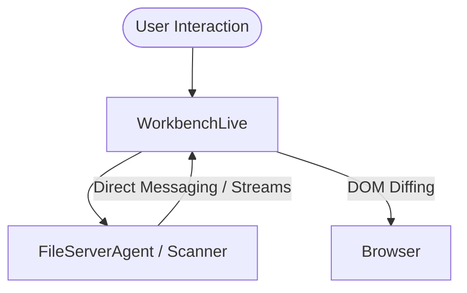

# Ether IDE - Agent Architecture
**Last Updated:** 2026-01-09

---

## Overview

Ether uses a multi-agent architecture where specialized agents handle different aspects of IDE functionality. With the transition to **Phoenix LiveView**, agents are now integrated directly into the UI process, eliminating the manual JSON serialization layer.

---

## Core Agents

### 1. FileServerAgent
**Module:** `Ether.Agents.FileServerAgent`
**Responsibility:** Safe file I/O operations

```elixir
# API
FileServerAgent.read_file(path)    # {:ok, content} | {:error, reason}
FileServerAgent.write_file(path, content)  # :ok | {:error, reason}
FileServerAgent.list_files(path)   # {:ok, [files]}
```

### 2. Scanner (Level 5 Native)
**Module:** `Ether.Scanner`
**Responsibility:** High-performance directory traversal using **Safe Zig NIFs** (Binary Protocol).

```elixir
# API
Ether.Scanner.scan(directory, ignores \\ [])
# -> [list of {path, type} tuples]
#
# Examples: 
# Ether.Scanner.scan(".")
# Ether.Scanner.scan(".", [".git", "dist", "node_modules"])
```

**Features:**
*   **Dynamic Ignores**: Pass a list of folder names to skip at the native C-level.
*   **Memory Safe**: Uses `BeamAllocator` to prevent leaks and Double-Frees.
*   **Scheduler Friendly**: Consumes timeslices to prevent blocking other processes.

### 3. Explorer
**Module:** `Ether.Explorer`
**Responsibility:** UI-centric file transformation and tree building for LiveView.

---

## Communication Pattern (Unified Stack)



By leveraging **Phoenix Streams**, we achieve low-latency updates for large file trees without the "Communication Tax" of the previous Svelte/Channel architecture.

---

## Quick Start (New PC Setup)

```bash
# After cloning on any PC:
.\check_env.bat      # Check tools installed
mix deps.get         # Install backend deps
cd assets && bun install && cd ..  # Asset deps (Monaco, Tailwind)
mix compile          # Build everything
.\start_dev.bat      # Run
```
