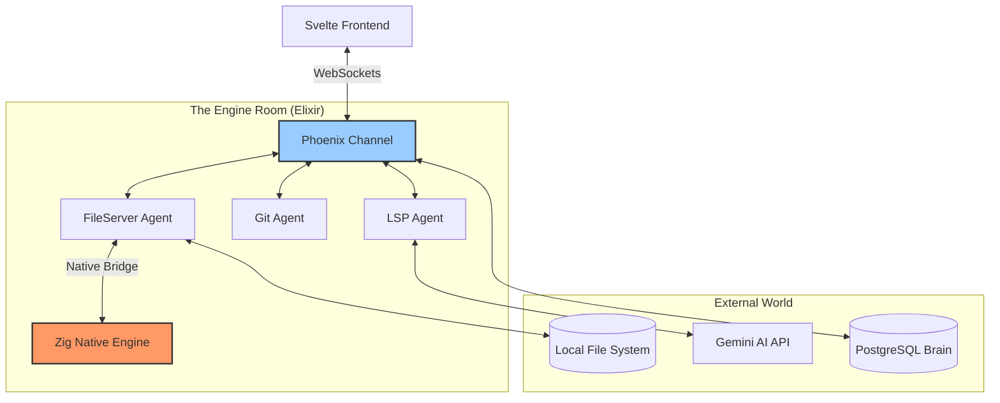

# 🛠️ The Engine Room: Ether Backend Map

The backend is the "Soul" of Ether. While you see the gorgeous UI, these are the invisible gears that do the heavy lifting.

## 🏗️ The Architecture (Bird's Eye View)



## 💓 Where the "Heart" Lives (The Code)
If you want to "see" the backend logic, look at these specific files:

1.  **[editor_channel.ex](file:///c:/GitHub/Ether/lib/ether_web/channels/editor_channel.ex)**: The "Receptionist." It receives every click and keystroke from the UI and routes it to the right agent.
2.  **[file_server_agent.ex](file:///c:/GitHub/Ether/lib/ether/agents/file_server_agent.ex)**: The "Librarian." This is the GenServer that manages all file I/O operations.
3.  **[scanner.ex](file:///c:/GitHub/Ether/lib/ether/scanner.ex)**: The "Bridge." This is the Elixir code that calls your **Zig Native Code**.

## 🎮 How to "Talk" to your Backend
The best way to see the backend "breathing" is through the **Interactive Elixir (IEx)** console. 

1.  In your terminal, run: `iex -S mix`.
2.  To see all running "Agents" (the workers), type:
    ```elixir
    # This shows you the status of the file librarian
    Ether.Agents.FileServerAgent.get_recent_files()
    ```
3.  To see the "Health" of the entire system (The Dashboard), type:
    ```elixir
    :observer.start()
    ```
    *(Note: This opens a separate Windows window that shows every single process in your IDE's 'Brain')*

---
*Created per USER request to "See the Backend"*
